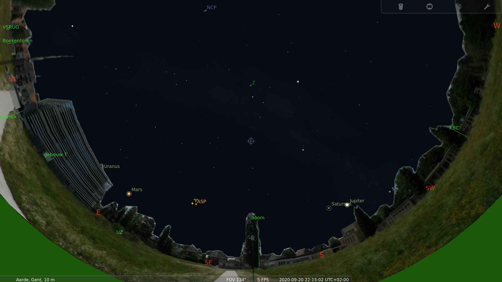
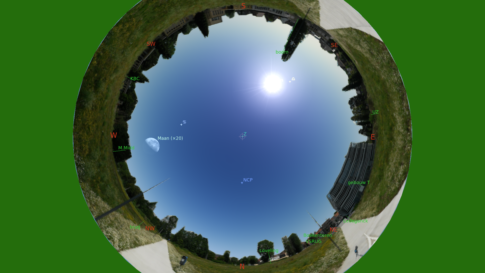
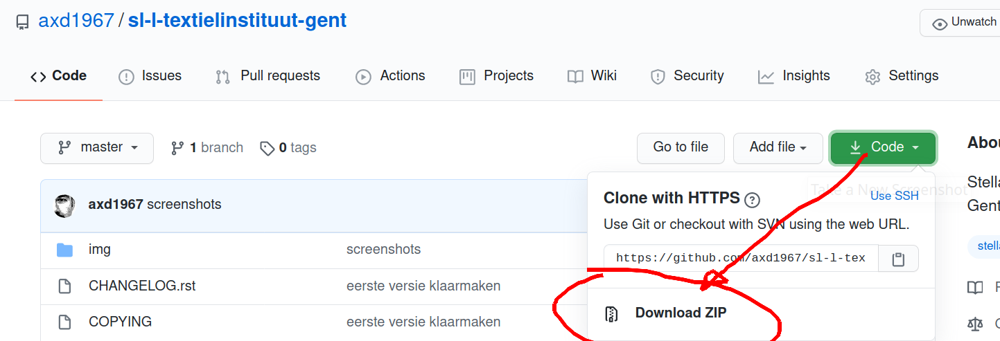

Stellarium landscape Campus Schoonmeersen (halte Textielinstituut, Voskenslaan

Landscape bestand voor gebruik in `Stellarium <https://stellarium.org/>`_. 

Gebruiksaanwijzing 
------------------

#. ga naar de `releases <https://github.com/axd1967/sl-l-textielinstituut-gent/releases>`_ pagina
#. download het zip bestand
#. in Stellarium importeer je dit .zip bestand via F4 > Landscape > Add/remove landscape
(zie ook https://github.com/axd1967/sl-l-gz1#installing-a-landscape)

Eventueel kan je ook de meest recente (niet volledig geteste) versie downloaden:

.. warning:: de horizon is nog experimenteel en dus niet helemaal nauwkeurig.

Andere landscapes: https://github.com/axd1967?tab=repositories&q=landscape

