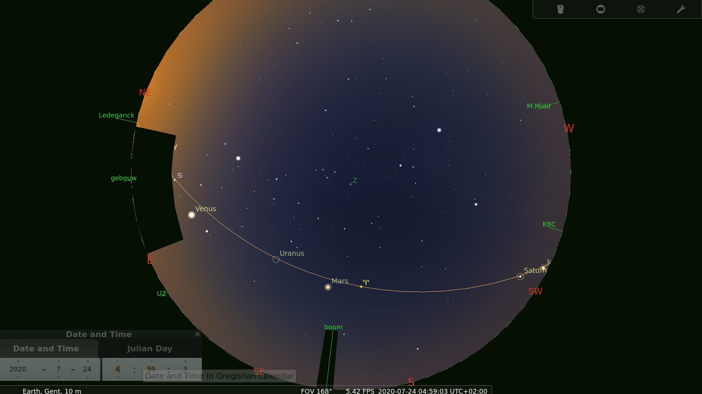
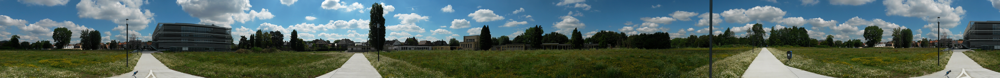

=================================================
Stellarium landscape Textielinstituut Voskenslaan
=================================================

Landscape bestand voor gebruik in `Stellarium <https://stellarium.org/>`_. 

Gebruiksaanwijzing: 

#. ga naar de `releases <https://github.com/axd1967/sl-l-textielinstituut-gent/releases>`_ pagina
#. download het zip bestand
#. in Stellarium importeer je dit .zip bestand via F4 > Landscape > Add/remove landscape

.. warning:: de horizon is nog experimenteel en dus niet helemaal nauwkeurig.

.. image:: img/Screenshot_20200731_114133.png

Andere landscapes: https://github.com/axd1967?tab=repositories&q=landscape

